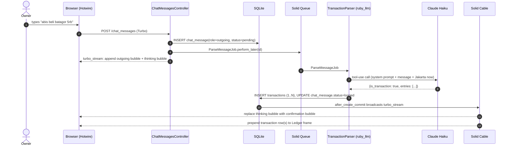

# feat: Finance chatbot — chat-first expense & income ledger (v1)

## Overview

Greenfield Rails 8 application that lets a single user log expenses and income by chatting in Bahasa Indonesia (e.g., "abis beli batagor 5rb"). Claude Haiku (via `ruby_llm`) parses each message into structured Ledger rows under a fixed category list. Two-screen app (Chat + Ledger) deployed to a VPS via Kamal. Built with vanilla Rails 8 stack — SQLite, Hotwire, Solid Queue, Solid Cable — and `has_secure_password` for the single-user login.

---

## Problem Frame

Expense trackers die on logging friction. The owner wants entry to feel like sending a WhatsApp message, and the categorization burden handed off to AI. This is a personal tool, mobile-first, deployed to a real URL so it works from a phone after a purchase. See origin `docs/brainstorms/finance-chatbot-requirements.md` for the full framing and the explicit "plain-list v1 is an accepted bet" trade-off.

---

## Requirements Trace

- R1. Two screens only: Chat (default) + Ledger, reached via header nav links.
- R2. Chat screen: WhatsApp-style bubble list, pinned input, canonical IDR format via `number_to_currency`.
- R3 / R3a. Parser Agent returns `{is_transaction, entries[]}`; per-entry direction, mixed expense+income allowed, multi-item split, `N × item @ price → N rows`.
- R4. Indonesian amount shorthand via prompt only.
- R5. Relative dates resolved in Asia/Jakarta.
- R6. `is_transaction = false` → polite reply, no row. Amount-less verb ("abis beli batagor") → clarifying reply asking for price.
- R7. Parser Agent failure/timeout → error bubble "Gagal mencatat, coba lagi.", no row.
- R8. Ledger row fields: date, description, amount (signed), category, reference back to chat message.
- R9. Ledger screen: plain reverse-chrono list, no totals.
- R10. Inline edit of amount/direction/category/date/description; category dropdown filters by direction; delete keeps chat bubble but replaces its content with "(entry dihapus)".
- R11. Fixed category list (hardcoded).
- R12. VPS + HTTPS; single-user password login; recovery via SSH + `kamal deploy`.
- R13. Mobile browser usable; chat input above keyboard.

**Origin actors:** A1 (Owner, single user), A2 (Parser Agent — Claude Haiku via `ruby_llm`), A3 (Ledger).
**Origin flows:** F1 (Log expense), F2 (Log income), F3 (Correct mis-parsed entry), F4 (Handle non-transaction message).
**Origin acceptance examples:** AE1 (relative date), AE2 (income), AE3 (non-transaction), AE4 (edit category), AE5 (Parser failure), AE6 (multi-item), AE7 (arithmetic), AE8 (mixed direction), AE9 (amount-less verb).

---

## Scope Boundaries

Carried from origin (not in v1):
- Multi-user, public signup, family accounts.
- Real WhatsApp integration (Business API / Twilio / Fonnte).
- Transfers / double-entry bookkeeping.
- Monthly summaries, totals, category breakdowns, charts.
- Editable or user-defined categories.
- Attachments, OCR, bank sync, CSV I/O.
- Recurring transactions, multi-currency, bulk ops, push notifications.

### Deferred to Follow-Up Work

- **v2 insight features** (running totals, monthly summary): not this plan. Revisit after ~6 weeks of real use per the plain-list-as-accepted-bet decision in origin.

---

## Context & Research

### Relevant Code and Patterns

Greenfield repo. No local patterns yet; the plan establishes them. Conventions to follow:
- Rails 8 generators (`bin/rails g authentication`, `bin/rails g model`, `bin/rails g scaffold` as starting points — trim to taste).
- Turbo Streams for broadcast-driven UI updates.
- Solid Queue + Solid Cable (Rails 8 defaults) — no Redis, no Sidekiq.
- SQLite as the production DB (Rails 8 + Kamal-idiomatic for a personal tool).
- Fat models, thin controllers, service class for the Parser Agent.
- TailwindCSS (Rails 8 default install) for styling.

### Institutional Learnings

- None local. `docs/solutions/` is empty (greenfield).

### External References

- [Ruby on Rails 8 release notes](https://rubyonrails.org/2024/11/7/rails-8-0-0-release) — Authentication generator, rate limiter, Solid Queue/Cache/Cable defaults.
- [`ruby_llm` gem docs](https://rubyllm.com) — tool-use / structured output support.
- [Kamal 2 docs](https://kamal-deploy.org) — proxy, secrets, Let's Encrypt.
- [Anthropic model list](https://docs.claude.com/en/docs/about-claude/models) — verify exact Haiku 4.5 slug at implementation time.

---

## Key Technical Decisions

- **Async parser pipeline via Solid Queue + Turbo Streams.** Sync in-request parsing would block the Puma thread for 1-3s per message. The async path broadcasts an immediate "thinking" bubble, processes the message in a job, and broadcasts the confirmation bubble + ledger row on completion. This is the Rails 8 idiomatic path with Hotwire; no extra infra required. Per-user queue serialization (single user, single queue lane) guarantees ordering.
- **`has_secure_password` + Rails 8 authentication generator, not Devise.** Single-row User; `bin/rails g authentication` produces a lightweight Session model that ticks R12's "logged in / logged out" framing cleanly.
- **Rails 8 built-in `rate_limit` filter, not `rack-attack`.** `Session#create` limited to N/hour to cap brute force; `Messages#create` limited to N/minute to cap Anthropic cost abuse if the password leaks.
- **Two-table data model: `chat_messages` + `transactions`.** One chat message produces 0..N transactions (R3/R3a). A single table collapsing both would conflate the "user said something" log with the "what I spent" log. Separation preserves R8's "reference back to the original chat message" invariant and makes delete-but-keep-bubble (R10) trivial (nullable FK, or keep the row and show the bubble from the ChatMessage side).
- **Tool-use / structured output for the Parser Agent, not free-text JSON.** `ruby_llm` supports Anthropic tool calls with a JSON schema; tool-use raises the floor on malformed-JSON failures. Exact API surface is verified during U3.
- **Amounts stored as `amount_cents` (integer rupiah — no actual cents in IDR).** One integer column. Currency precision irrelevant for IDR but the integer-storage convention still protects against float drift if any non-IDR currency is added later.
- **Asia/Jakarta timezone via `config.time_zone`; `Time.current` everywhere.** Passing `Time.current` into the Parser Agent's system prompt on every call is what lets "kemarin" resolve correctly — the model doesn't know what today is otherwise.
- **Plain Tailwind for WhatsApp-style bubbles, no separate component library.** One `_bubble.html.erb` partial handles outgoing/incoming/confirmation/error variants.

---

## Open Questions

### Resolved During Planning

- **Sync vs async parsing:** Async via Solid Queue (see Key Technical Decisions).
- **Auth implementation:** Rails 8 `bin/rails g authentication` + `has_secure_password`.
- **Rate limiting:** Rails 8 built-in `rate_limit` filter on Sessions + Messages.
- **Data model:** Two tables (`chat_messages` + `transactions`).
- **Structured output strategy:** Anthropic tool-use via `ruby_llm`.
- **Currency storage:** Integer `amount_cents` (effectively `amount_rupiah` for IDR).
- **Thinking bubble:** Turbo Stream appends a typing-indicator bubble; job broadcasts replace it with confirmation/error on completion.
- **Bubble ↔ row sync on Ledger-side edits:** `after_update_commit` on `Transaction` broadcasts a Turbo Stream replace targeting the corresponding bubble's DOM id — single source of truth.
- **Concurrent message ordering:** Single-user, single-queue Solid Queue lane — messages process strictly FIFO.
- **`config.filter_parameters`:** Redact `message[content]` and any Anthropic API key.
- **Kamal secrets:** `.kamal/secrets` gitignored, sourced from the deploy host's ENV or a 1Password-cli lookup.

### Deferred to Implementation

- **Exact `ruby_llm` tool-call API shape** — verified against the installed gem version in U3.
- **Exact Claude Haiku 4.5 model slug** — verified against Anthropic's model list at deploy time.
- **Mobile keyboard behavior** (iOS Safari / Android Chrome) — requires real-device testing in U5; fall back to `interactive-widget=resizes-content` + `100dvh` if the naive approach breaks.
- **Tailwind tokens for bubble colors, border radius, spacing** — decided while building U5 and iterated against real screenshots.
- **Health check endpoint path for Kamal** — `/up` is the Rails 8 default; confirm the Kamal proxy setup accepts it in U6.

---

## Output Structure

    app/
      controllers/
        application_controller.rb          # authentication helpers (from generator)
        sessions_controller.rb             # login (from generator)
        chat_messages_controller.rb        # POST to create a message, enqueue ParseMessageJob
        transactions_controller.rb         # index (Ledger), edit, update, destroy
      models/
        user.rb                            # has_secure_password, single-row
        session.rb                         # from Rails 8 auth generator
        chat_message.rb                    # role enum, parser_status enum, broadcasts to owner
        transaction.rb                     # belongs_to :chat_message, direction enum, broadcasts to owner
        current.rb                         # from Rails 8 auth generator
      jobs/
        parse_message_job.rb               # Solid Queue, calls TransactionParser
      services/
        transaction_parser.rb              # wraps ruby_llm, returns structured entries
      views/
        layouts/
          application.html.erb             # header nav (Chat | Ledger), mobile-aware viewport
        chat_messages/
          _message.html.erb                # outgoing / incoming bubble partial
          _confirmation.html.erb           # "✓ Logged ..." bubble with edit affordance
          _thinking.html.erb               # typing-indicator bubble
          index.html.erb                   # Chat screen (turbo-frame + input form)
          create.turbo_stream.erb          # append user bubble + thinking bubble
        transactions/
          _transaction.html.erb            # Ledger row
          _form.html.erb                   # inline edit form (modal)
          index.html.erb                   # Ledger screen
          edit.html.erb                    # inline edit view (turbo-frame)
      helpers/
        application_helper.rb              # `rupiah(amount_cents)` formatter
      channels/                            # (default Rails cable setup)
    config/
      application.rb                       # config.time_zone = "Asia/Jakarta"
      initializers/
        filter_parameter_logging.rb        # redact message content + api key
      routes.rb                            # root "chat_messages#index", resources :transactions, resource :session
      credentials/
        production.yml.enc                 # anthropic_api_key
      deploy.yml                           # Kamal
    .kamal/
      secrets                              # gitignored; sources ANTHROPIC_API_KEY + RAILS_MASTER_KEY
    db/
      migrate/
        20260423000001_create_users.rb
        20260423000002_create_sessions.rb
        20260423000003_create_chat_messages.rb
        20260423000004_create_transactions.rb
      seeds.rb                             # single User from Rails.application.credentials
    test/
      models/
        chat_message_test.rb
        transaction_test.rb
        user_test.rb
      services/
        transaction_parser_test.rb         # stubs ruby_llm
      jobs/
        parse_message_job_test.rb
      controllers/
        chat_messages_controller_test.rb
        transactions_controller_test.rb
        sessions_controller_test.rb
      system/
        chat_flow_test.rb                  # end-to-end: login → type → see bubble → see row
        ledger_flow_test.rb                # inline edit + delete

---

## High-Level Technical Design

> *This illustrates the intended async parse pipeline. Directional guidance for review, not implementation specification.*



Failure branch: Claude returns malformed / times out → `ParseMessageJob` rescues → updates `chat_message.status=failed` → broadcasts replace thinking bubble with error bubble. No rows written.

---

## Implementation Units

- [ ] U1. **Rails 8 app scaffolding + authentication + timezone**

**Goal:** Initialize the greenfield Rails 8 app, wire the authentication generator for a single-row User, pin Asia/Jakarta timezone, configure filter_parameters, and stub a root route.

**Requirements:** R1 (Chat is default landing), R12 (password gate, no signup/reset), R13 (mobile-usable layout baseline).

**Dependencies:** None.

**Files:**
- Create: `Gemfile` (add `ruby_llm`), `config/application.rb`, `config/routes.rb`, `config/initializers/filter_parameter_logging.rb`
- Create: `app/models/user.rb`, `app/models/session.rb`, `app/models/current.rb`, `app/controllers/sessions_controller.rb`, `app/controllers/application_controller.rb` (from `bin/rails g authentication`)
- Create: `db/migrate/*_create_users.rb`, `db/migrate/*_create_sessions.rb`, `db/seeds.rb`
- Create: `app/views/layouts/application.html.erb` (header nav stubs for Chat | Ledger)
- Test: `test/models/user_test.rb`, `test/controllers/sessions_controller_test.rb`

**Approach:**
- `rails new finance_chatbot --skip-jbuilder --css=tailwind` (Rails 8 default stack: SQLite, Solid Queue, Solid Cable, Hotwire included).
- Add `ruby_llm` to Gemfile; `bundle install`.
- Run `bin/rails g authentication` and keep the generator output minimal.
- Seed a single User from `Rails.application.credentials.dig(:owner, :email)` + `:password` in `db/seeds.rb`.
- Set `config.time_zone = "Asia/Jakarta"` in `config/application.rb`.
- Add `message` and `content` to `Rails.application.config.filter_parameters`.
- Add `rate_limit to: 5, within: 1.minute, only: :create` on `SessionsController` (Rails 8 built-in).
- Root route: `root "chat_messages#index"` (the controller lands in U4/U5 but the route is set now so login redirects work).

**Patterns to follow:**
- Rails 8 authentication generator output (accept the generator's shape, don't hand-roll).
- Credentials-based config, no ENV-var hunting inside code.

**Test scenarios:**
- Happy path: seeded user can log in with email + password from credentials; redirect lands on root.
- Error path: wrong password → re-renders new with error; no session cookie.
- Edge case: 6th login attempt within a minute returns 429 (`rate_limit` triggers).
- Integration: `config.time_zone` is `Asia/Jakarta` (`Time.zone.name` assertion in an initializer test).
- Integration: `Rails.application.config.filter_parameters` includes `:content` (guards against logging chat text).

**Verification:**
- `bin/rails test` green.
- `bin/rails s` boots; root is inaccessible without login; login with seeded credentials succeeds.

---

- [ ] U2. **Data model: ChatMessage + Transaction**

**Goal:** Create the two tables, associations, enums, and validations the rest of the app will read from.

**Requirements:** R3, R8, R10, R11.

**Dependencies:** U1.

**Files:**
- Create: `db/migrate/*_create_chat_messages.rb`, `db/migrate/*_create_transactions.rb`
- Create: `app/models/chat_message.rb`, `app/models/transaction.rb`
- Modify: `app/models/user.rb` (add `has_many :chat_messages`, `has_many :transactions, through: :chat_messages`)
- Test: `test/models/chat_message_test.rb`, `test/models/transaction_test.rb`

**Approach:**
- `chat_messages`: `user_id` (FK), `role` (enum: `outgoing`, `incoming`), `content` (text), `parser_status` (enum: `pending`, `logged`, `not_transaction`, `failed`), `reply_text` (text, nullable — for the "no row" replies), timestamps. Index on `(user_id, created_at)`.
- `transactions`: `chat_message_id` (FK, nullable so bubbles survive row deletion), `amount_cents` (integer, not null), `direction` (enum: `expense`, `income`), `category` (string, not null, constrained to R11 values via model validation), `occurred_on` (date — Jakarta date, not timestamp), `description` (string), timestamps. Index on `(occurred_on desc)`.
- Categories constant in `Transaction::CATEGORIES` — hash keyed by direction, e.g., `{ expense: ["Makanan & Minuman", ...], income: ["Gaji", "Lainnya (Income)"] }`. Validator enforces `category ∈ CATEGORIES[direction]`.
- `Transaction` signed display helper: `signed_amount_cents` returns `+amount_cents` for income, `-amount_cents` for expense.
- `before_validation :default_occurred_on`, sets `Time.current.to_date` in Jakarta.

**Patterns to follow:**
- Enum declaration with database backing (`enum :direction, { expense: 0, income: 1 }`).
- Constants in class namespace rather than a separate config file.

**Test scenarios:**
- Happy path: `ChatMessage.create!(user:, role: :outgoing, content: "x")` succeeds with `parser_status: :pending`.
- Happy path: `Transaction.create!(chat_message:, amount_cents: 5000, direction: :expense, category: "Makanan & Minuman")` succeeds with `occurred_on == Date.current` in Jakarta.
- Edge case: `Transaction` with `direction: :expense` and `category: "Gaji"` is invalid (category mismatch).
- Edge case: `Transaction` with `amount_cents: 0` is invalid (presence + numericality > 0).
- Error path: `Transaction` with an unknown category string is invalid.
- Integration: deleting a `Transaction` leaves its `ChatMessage` untouched (FK nullable).
- Integration: `user.transactions` returns rows through `chat_messages`.

**Verification:**
- `bin/rails db:migrate && bin/rails test test/models` green.
- `User.first.chat_messages.create!(...)` then `Transaction.create!(...)` reads back with correct signed amount.

---

- [ ] U3. **TransactionParser service — `ruby_llm` + Claude Haiku tool-use**

**Goal:** A service class that takes a chat message and returns structured parse results via Claude Haiku.

**Requirements:** R3, R3a, R4, R5, R6, R7.

**Dependencies:** U2 (needs ChatMessage/Transaction + categories constant).

**Files:**
- Create: `app/services/transaction_parser.rb`
- Create: `config/initializers/ruby_llm.rb` (API key wiring)
- Test: `test/services/transaction_parser_test.rb`

**Approach:**
- `TransactionParser.new(chat_message).parse` returns a result struct: `ok?`, `is_transaction?`, `entries:` (array of hashes), `reply_text:` (for non-transaction replies), `error:` (for failure).
- Single system prompt that enumerates `Transaction::CATEGORIES`, amount shorthand rules (R4), relative date rules (R5), arithmetic rule (R3a), amount-less behavior (R6: `is_transaction=false` with `reply_text` asking for price). Injects current Jakarta time (`Time.current.to_s`) on every call so "kemarin"/"tadi" resolve correctly.
- Anthropic tool-use via `ruby_llm`: one tool `record_transactions(entries: [...])` whose JSON schema enforces the entry shape. Model either calls the tool (transaction) or replies in text (non-transaction / clarifying).
- Timeout: wrap the call in `Timeout.timeout(15)`; on timeout/HTTPError/tool-validation-error return `ok? = false, error: :parser_failure`.
- Return `ok? = true, is_transaction: true, entries: [...]` for tool-calls; `ok? = true, is_transaction: false, reply_text: ...` for text replies.

**Technical design:** *(directional, not spec)*

```
TransactionParser#parse:
  input: ChatMessage
  output: Result(ok?, is_transaction?, entries, reply_text, error)

  system_prompt = build_prompt(categories: CATEGORIES, now: Time.current)
  response = ruby_llm
    .chat(model: ANTHROPIC_MODEL)
    .with_tool(TOOL_SCHEMA)
    .ask(message.content, system: system_prompt)

  case response
  when tool_call(:record_transactions, args)
    Result.new(ok: true, is_transaction: true, entries: args[:entries])
  when text_reply(text)
    Result.new(ok: true, is_transaction: false, reply_text: text)
  end
rescue Timeout::Error, RubyLLM::Error => e
  Result.new(ok: false, error: e.class.name)
```

**Patterns to follow:**
- Plain Ruby service class under `app/services/` — no framework inheritance, no YAGNI base class.
- Result object is a `Data.define(...)` struct.

**Test scenarios:**
- Covers AE1. Happy path: `"kemarin beli bensin 50rb"` → `is_transaction: true`, `entries: [{amount_cents: 50000, direction: :expense, category: "Transport", occurred_on: Date.current.yesterday, description: "bensin"}]`. (Stubbed `ruby_llm` response.)
- Covers AE2. Happy path: `"gajian 10jt masuk"` → income entry, Gaji category.
- Covers AE3. Non-transaction: `"halo apa kabar"` → `is_transaction: false`, `reply_text` present, no entries.
- Covers AE5. Error path: stub `ruby_llm` to raise `Timeout::Error` → `ok? false, error: "Timeout::Error"`.
- Covers AE6. Multi-item: `"beli nasi 25rb sama es teh 5rb"` → two entries.
- Covers AE7. Arithmetic: `"beli 2 nasi @25rb"` → two entries at 25000 each, not one at 50000.
- Covers AE8. Mixed direction: `"dapet 500rb trus beli baju 200rb"` → entries of mixed direction.
- Covers AE9. Amount-less: `"abis beli batagor"` → `is_transaction: false` with `reply_text` asking for price.
- Edge case: tool returns entry with category not in `CATEGORIES` → treat as parser_failure.
- Edge case: `is_transaction: true` with empty entries array → treat as `is_transaction: false`.
- Integration: system prompt includes current Jakarta time (grep the prompt string sent to `ruby_llm`).

**Verification:**
- `bin/rails test test/services` green with stubbed `ruby_llm` responses.
- Manual smoke: `TransactionParser.new(ChatMessage.last).parse` against a live key returns a well-formed result for a canonical expense message.

---

- [ ] U4. **Async parse pipeline: ParseMessageJob + Turbo broadcasts**

**Goal:** Wire the Solid Queue job that calls `TransactionParser` and broadcasts UI updates (thinking → confirmation / error / non-transaction-reply).

**Requirements:** R3, R6, R7, plus the "thinking bubble" and ordering decisions in Key Technical Decisions.

**Dependencies:** U3.

**Files:**
- Create: `app/jobs/parse_message_job.rb`
- Create: `app/controllers/chat_messages_controller.rb`
- Modify: `app/models/chat_message.rb` (add `broadcasts_to :user`, partial callbacks), `app/models/transaction.rb` (add `broadcasts_to ->(t) { t.chat_message.user }` on create/update)
- Modify: `config/routes.rb` (add `resources :chat_messages, only: [:index, :create]`)
- Test: `test/jobs/parse_message_job_test.rb`, `test/controllers/chat_messages_controller_test.rb`

**Approach:**
- `ChatMessagesController#create`: creates `ChatMessage(role: :outgoing, parser_status: :pending)`, enqueues `ParseMessageJob.perform_later(chat_message)`, responds with a Turbo Stream that appends the outgoing bubble and a `_thinking` bubble (`id: "thinking_#{chat_message.id}"`).
- Rails 8 `rate_limit to: 60, within: 1.minute, only: :create` on the controller (abuse cap).
- `ParseMessageJob#perform(chat_message)`:
  - Call `TransactionParser.new(chat_message).parse`.
  - If `result.ok? && result.is_transaction`: create one `Transaction` per entry under a single DB transaction, update `chat_message.parser_status = :logged`, then `Turbo::StreamsChannel.broadcast_replace_to(user, target: "thinking_#{id}", partial: "chat_messages/confirmation", locals: {chat_message:})`.
  - If `result.ok? && !result.is_transaction`: update `chat_message.parser_status = :not_transaction, reply_text: result.reply_text`, broadcast replace with a `_reply` partial.
  - If `!result.ok?`: update `chat_message.parser_status = :failed`, broadcast replace with an `_error` partial (content "Gagal mencatat, coba lagi.").
- `Transaction`'s `after_create_commit` broadcasts `prepend` to `"transactions"` target on the Ledger screen; `after_update_commit` broadcasts `replace`; `after_destroy_commit` broadcasts `remove` (R10: but bubble stays — handled via `ChatMessage`, not Transaction).
- Queue lane: Solid Queue default lane. Single user = strict FIFO without extra config.

**Patterns to follow:**
- `broadcasts_to` with a lambda that resolves the subscriber (User), not the default `self` shortcut.
- `Turbo::StreamsChannel.broadcast_replace_to` for explicit targets; let `broadcasts_to` handle prepends on the Transaction side.

**Test scenarios:**
- Covers F1 / AE1. Happy path: POST `/chat_messages` with "kemarin beli bensin 50rb" (stub Parser) → job runs → `Transaction` count +1, `ChatMessage#parser_status == :logged`, broadcast_replace fires with confirmation partial.
- Covers AE3 / F4. Non-transaction: Parser returns `is_transaction: false` → no Transaction created, `parser_status == :not_transaction`, reply partial broadcast.
- Covers AE5 / R7. Parser failure: Parser raises → `parser_status == :failed`, error partial broadcast.
- Covers AE6 / AE8. Multi-item + mixed-direction: Parser returns 2 entries → 2 Transactions in one DB transaction; single confirmation bubble listing both.
- Edge case: if `Transaction.create!` fails partway through a batch, the whole batch rolls back and `parser_status` becomes `:failed` (DB transaction wraps the loop).
- Error path: POST 61st chat message within 1 minute → 429 from rate_limit.
- Integration: enqueuing two ParseMessageJobs in rapid succession — Solid Queue processes them in order; the second's broadcast arrives after the first's.

**Verification:**
- `bin/rails test test/jobs test/controllers/chat_messages_controller_test.rb` green.
- `bin/rails solid_queue:start` processes jobs without errors in dev.
- Manual smoke: type a message, see thinking bubble, see it replaced by confirmation bubble, see row appear in Ledger tab.

---

- [ ] U5. **Views: Chat screen, Ledger screen, inline edit, mobile polish**

**Goal:** Build the two screens end-to-end — chat input, bubble list, ledger list, inline edit/delete — and make it feel right on a phone.

**Requirements:** R1, R2, R8, R9, R10, R13, plus the canonical `Rp 5.000` format.

**Dependencies:** U4.

**Files:**
- Create: `app/views/layouts/application.html.erb` (flesh out from U1 stub), `app/views/chat_messages/index.html.erb`, `app/views/chat_messages/_message.html.erb`, `app/views/chat_messages/_confirmation.html.erb`, `app/views/chat_messages/_thinking.html.erb`, `app/views/chat_messages/_reply.html.erb`, `app/views/chat_messages/_error.html.erb`, `app/views/chat_messages/create.turbo_stream.erb`
- Create: `app/controllers/transactions_controller.rb`, `app/views/transactions/index.html.erb`, `app/views/transactions/_transaction.html.erb`, `app/views/transactions/_form.html.erb`, `app/views/transactions/edit.html.erb`
- Create: `app/helpers/application_helper.rb` (`rupiah(cents)` helper)
- Modify: `config/routes.rb` (`resources :transactions, only: [:index, :edit, :update, :destroy]`)
- Test: `test/controllers/transactions_controller_test.rb`, `test/system/chat_flow_test.rb`, `test/system/ledger_flow_test.rb`

**Approach:**
- Layout header: two links "Chat" and "Ledger" with Turbo navigation; `viewport` meta includes `interactive-widget=resizes-content`.
- Chat view (`index`): `turbo-frame id="messages"` scrollable, `<%= form_with url: chat_messages_path, data: { turbo_frame: "_top" } %>` for the input; auto-focus on load; `Turbo::StreamsChannel` subscription under `stream_from current_user`.
- Chat CSS: flex column, input pinned to bottom via `position: sticky; bottom: 0; safe-area-inset` + `height: 100dvh` container. Auto-scroll to newest message on new-message stream.
- Bubble partials: outgoing = right-aligned green, incoming/confirmation/reply/error = left-aligned white; confirmation includes a small edit icon linking to `/transactions/:id/edit`.
- Ledger view: reverse-chrono list of `<%= render Transaction.ordered %>`. Each row shows `rupiah(signed_amount_cents)` with red for expense, green for income; tap opens `/transactions/:id/edit` via `turbo-frame`.
- Inline edit form: replaces the row in place; category dropdown is a Stimulus controller (`category_filter_controller.js`) that rebuilds options when direction changes; delete button with `turbo-confirm`.
- On destroy: custom turbo_stream renders an `_entry_dihapus` partial replacing the original bubble's content with "(entry dihapus)".
- `rupiah` helper: `number_to_currency(cents, unit: "Rp ", separator: ",", delimiter: ".", precision: 0)`.
- Tailwind: use existing Rails 8 install; no extra component lib.

**Patterns to follow:**
- Turbo Frames for per-row inline edit; Turbo Streams for broadcast updates (already wired in U4).
- Stimulus controller for the one client-side concern (direction → category filter); no React, no Alpine.

**Test scenarios:**
- Covers R2. System: GET `/` when logged in renders Chat as default; header shows both nav links.
- Covers R9. System: GET `/transactions` renders rows reverse-chrono, newest first.
- Covers AE4 / F3. System: tap a row → edit form appears in place → change category from "Lainnya" to "Makanan & Minuman" → save → row updates; chat bubble also updates (via broadcast from `Transaction#after_update_commit`).
- Covers R10. System: changing direction from expense → income clears the category and shows only income categories (Stimulus test).
- Covers R10. System: delete a transaction → row removed from Ledger; original chat bubble now shows "(entry dihapus)" text.
- Edge case (mobile): input stays visible when keyboard opens on iOS Safari (manual device test — documented in Verification, not automated).
- Integration: `rupiah(5000)` returns `"Rp 5.000"`; `rupiah(1500000)` returns `"Rp 1.500.000"`.
- Integration: confirmation bubble for multi-item parse shows all rows (AE6 / AE7 / AE8 formatting sanity).

**Verification:**
- `bin/rails test:system` green.
- Dev server + real phone: Chat view loads over LAN, keyboard doesn't cover input on iOS Safari 17+ and Android Chrome 120+, messages scroll naturally.
- Manual: AE1-AE9 walkthrough end-to-end in the browser.

---

- [ ] U6. **Kamal deploy to VPS**

**Goal:** Ship it to a VPS at a real HTTPS URL with Kamal; secrets wired for Anthropic + Rails master key.

**Requirements:** R12, R13 (real URL so phone can reach it).

**Dependencies:** U5.

**Files:**
- Create: `config/deploy.yml`, `.kamal/secrets`, `.kamal/hooks/pre-deploy` (optional smoke test)
- Modify: `Dockerfile` (verify Rails 8 defaults are fine), `.gitignore` (ensure `.kamal/secrets` is ignored)
- Modify: `config/routes.rb` if health check path needs adjustment
- Modify: `README.md` with deploy runbook (first-time setup + rotate-password recipe)

**Approach:**
- `kamal init`, then fill `deploy.yml` with: image name, one server (host), `kamal-proxy` with `ssl: true` and the production hostname, `env clear/secret` including `ANTHROPIC_API_KEY` + `RAILS_MASTER_KEY`.
- `.kamal/secrets` sources from deploy-host ENV (or 1Password CLI lookup) — never committed.
- Volumes: one mount for `storage/` (SQLite database file persistence across deploys).
- Health check: `/up` (Rails 8 default) — verify in `deploy.yml` proxy config.
- Credential rotation recipe (in README): `EDITOR=vim bin/rails credentials:edit` → change owner password → `kamal redeploy`.
- Smoke: `kamal setup` → `kamal deploy` → curl the URL.

**Patterns to follow:**
- Kamal 2 defaults, minimal config. No accessories (no Redis, no separate DB — SQLite on volume).
- Secrets via `.kamal/secrets`, not committed credentials.

**Test scenarios:**
- *Test expectation: none — this unit is configuration + ops runbook, verified by deploy, not by Rails test suite.*

**Verification:**
- `kamal setup` completes without errors on a fresh VPS.
- `kamal deploy` produces a running container reachable over HTTPS with a valid Let's Encrypt cert.
- Login works from a mobile browser over cellular; logging one message creates a ledger row visible on another page load.
- SQLite file persists across `kamal deploy` (verified by re-reading seeded user after a second deploy).
- Rotating the owner password via `credentials:edit` + `kamal redeploy` works without data loss.

---

## System-Wide Impact

- **Interaction graph:** Solid Queue runs in-process (Rails 8 default with Puma); Solid Cable uses the same SQLite DB — no external services. `after_*_commit` hooks on `Transaction` broadcast Turbo Streams; `broadcasts_to` on `ChatMessage` and `Transaction` both publish to the owner's stream. A single misfiring broadcast callback can duplicate rows on screen — enforce one broadcast source per lifecycle transition (e.g., prepend only from Transaction, replace bubble only from ChatMessage).
- **Error propagation:** Parser failures land in `ChatMessage#parser_status = :failed` and surface as an error bubble; they do NOT raise 500s to the user. Controller-level failures (DB full, schema mismatch) surface as standard Rails error pages.
- **State lifecycle risks:** Partial multi-entry writes are the main risk — a Parser returning 3 entries where entry 2 fails validation would leave a mixed state. Mitigated by wrapping the entry-creation loop in `ActiveRecord::Base.transaction`, so either all rows land or none do.
- **API surface parity:** None — no external API, no JSON endpoints. The only "surface" is the chat input → AI → ledger pipeline.
- **Integration coverage:** System tests in U5 cover the Controller → Job → Parser → DB → Broadcast → DOM round trip. Unit tests on the Parser stub `ruby_llm`.
- **Unchanged invariants:** N/A (greenfield).

---

## Risks & Dependencies

| Risk | Mitigation |
|------|------------|
| Claude Haiku misparses Bahasa shorthand ("1,5jt" ↔ "15jt") silently; the >80% zero-correction metric hides it. | After U3, test the stubbed-response harness against a hand-built corpus of 30-50 real-style messages before shipping; spot-check the first week of production parses. If accuracy is poor, add a deterministic regex pre-parse for amounts only (R4's "prompt only" assumption is explicitly renegotiable per origin). |
| `ruby_llm` tool-use API changes between versions, or the gem is unmaintained. | U3 pins a version in Gemfile.lock; U1 includes a fallback plan (swap to Anthropic's official SDK or a thin Faraday wrapper). Keep the TransactionParser interface narrow so the implementation detail is swappable. |
| Anthropic model slug `claude-haiku-4-5` changes or deprecates. | Store in `Rails.application.credentials.dig(:anthropic, :model)` — rotation is a credentials edit + redeploy, not a code change. Verify the current slug at U3 implementation time. |
| iOS Safari keyboard covers the chat input — R13 is the single most fragile UX requirement. | Test on a real device during U5; fall back to `interactive-widget=resizes-content` + `100dvh` + `safe-area-inset-bottom`. If both fail, add a small Stimulus controller that adjusts bottom padding on `visualViewport` resize. |
| Password leak → attacker burns Anthropic credits. | Rails 8 `rate_limit` on `Messages#create` caps daily calls; set a conservative Anthropic org-level spend cap as a second wall. |
| SQLite on a single VPS = single point of data-loss failure. | Document in README: use Kamal's volume mount + weekly `kamal app exec "cp storage/production.sqlite3 storage/backup-$(date +%F).sqlite3"` as a lightweight backup. Formal backup strategy is a v2 concern. |
| Broadcast duplicates (message appears twice in Chat). | Single-user, single-stream subscription; message partials use stable DOM IDs (`chat_message_#{id}`, `thinking_#{chat_message.id}`) so re-broadcasts replace instead of append. |

---

## Documentation / Operational Notes

- **README:** first-time setup (`bin/setup`), dev workflow, deploy runbook (Kamal first-time + redeploy), credential rotation recipe, "how to change the category list" (edit `Transaction::CATEGORIES`, redeploy — no migration).
- **Operational:** SQLite backup cron via Kamal hook (see Risks); Anthropic spend cap set at the org level.
- **Monitoring:** None in v1 — `kamal app logs` is the only observability surface. Sentry/Honeybadger is a v2 concern (already excluded in origin Scope Boundaries).

---

## Sources & References

- **Origin document:** `docs/brainstorms/finance-chatbot-requirements.md`
- Related code: none (greenfield).
- External docs:
  - Rails 8 release notes — https://rubyonrails.org/2024/11/7/rails-8-0-0-release
  - `ruby_llm` — https://rubyllm.com
  - Kamal 2 — https://kamal-deploy.org
  - Anthropic model list — https://docs.claude.com/en/docs/about-claude/models
